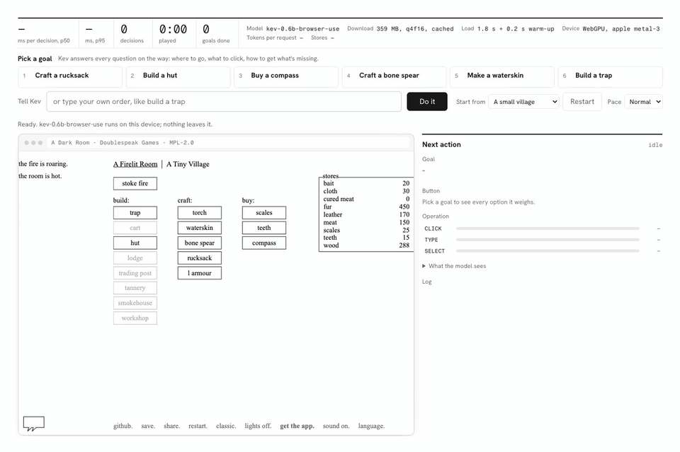
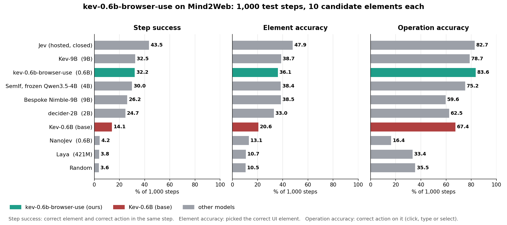

# kev-browser-use

A tiny 0.6B Jev-like model, fine-tuned from [Kev-0.6B](https://huggingface.co/jaredpalmer/kev-0.6b) for browser use.

**[Model on Hugging Face](https://huggingface.co/arbazsiddiqui/kev-0.6b-browser-use)** · **[Web build (ONNX)](https://huggingface.co/arbazsiddiqui/kev-0.6b-browser-use-ONNX)** · **[Live demo](https://arbazsiddiqui.me/kev-browser-use)**

<p>
  <a href="#results"></a>
  <a href="https://huggingface.co/jaredpalmer/kev-0.6b"></a>
  <a href="LICENSE"></a>
</p>

A decision model for browser agents. It reads a goal and a table of the page's candidate elements, then returns which element to act on and whether to click, type or select, as probabilities, in one forward pass. It never writes text.

**32.2% step success on Mind2Web**, the best of any open-weights model that runs in a browser, at 80 ms per decision.

<a href="https://arbazsiddiqui.me/kev-browser-use"></a>

## Results

1,000 steps from Mind2Web's test set. Each step gives a goal, the previous actions and 10 candidate elements. Every model sees the same text and the same candidates.



| Model | Size | Step success | Element accuracy | Operation accuracy | Brier (lower is better) | p50 latency |
|---|---|---|---|---|---|---|
| Jev (TypeSafe, hosted API) | closed | 43.5 | 47.9 | 82.7 | 0.73 | network |
| Kev-9B | 9B | 32.5 | 38.7 | 78.7 | 0.76 | 428 ms |
| **kev-0.6b-browser-use** | **0.6B** | **32.2** | **36.1** | **83.6** | 0.84 | 80 ms |
| SemIf, frozen Qwen3.5-4B | 4B | 30.0 | 38.4 | 75.2 | 0.85 | 289 ms |
| Bespoke Nimble-9B | 9B | 26.2 | 38.5 | 59.6 | 0.87 | 979 ms |
| decider-2B | 2B | 24.7 | 33.0 | 62.5 | 0.87 | 139 ms |
| Kev-0.6B (base) | 0.6B | 14.1 | 20.6 | 67.4 | 1.06 | 78 ms |
| NanoJev | 0.6B | 4.2 | 13.1 | 16.4 | 0.92 | 245 ms |
| Laya | 421M | 3.8 | 10.7 | 33.4 | 0.98 | 40 ms |
| Random |  | 3.6 | 10.5 | 35.5 | 0.94 |  |

- **Step success:** the correct element and the correct action in the same step, the number that matters for an agent.
- **Element accuracy:** the model picked the correct UI element.
- **Operation accuracy:** it chose the correct action on that element (click, type or select).
- **Brier (lower is better):** how good the model's probabilities are, not just its top pick. It adds up the squared error over all 10 candidates, so it runs from 0 to 2 and hits 2 when the model is certain of a wrong element.

Latency is one decision on an NVIDIA L4. `python3 eval/harness.py table` builds the table from `results/` and `python3 eval/plot_results.py` draws the chart.

## Quick start

### In the browser

The 4-bit web build (348 MB, WebGPU) runs with [open-jev](https://www.npmjs.com/package/open-jev).

```bash
npm install open-jev @huggingface/transformers
```

```js
import { OpenJev, choice } from "open-jev";

const kev = await OpenJev.load({ model: "arbazsiddiqui/kev-0.6b-browser-use-ONNX", dtype: "q4f16" });

const state = `Goal: Type "Alan Turing" into the search box
Candidate elements:
[0] <a> role=None "Main page"
[1] <input> role=searchbox "Search Wikipedia"
[2] <button> role=None "Search"`;

const { element, operation } = await kev.decide(state, {
  element: choice("Which element should be acted on?", [
    '[0] <a> "Main page"',
    '[1] <input> "Search Wikipedia"',
    '[2] <button> "Search"',
  ]),
  operation: choice("What operation should be performed on the target element?", ["CLICK", "TYPE", "SELECT"]),
});

element.choice;     // '[1] <input> "Search Wikipedia"', confidence 0.93
operation.choice;   // "TYPE", confidence 0.74
```

### On a server

The full-precision checkpoint is a LoRA adapter plus a pointer head in [Kev](https://github.com/jaredpalmer/kev)'s format, served by Kev's own server.

```bash
git clone https://github.com/jaredpalmer/kev.git && cd kev && uv sync --extra serve
uv run --extra serve python -m kev.serve --run arbazsiddiqui/kev-0.6b-browser-use --port 8009
```

```bash
curl -s localhost:8009/v1/systemone -H 'content-type: application/json' -d '{
  "model": "kev-latest",
  "state": "Goal: Search Wikipedia for \"Alan Turing\"\nCandidate elements:\n[0] <a> role=None \"Main page\"\n[1] <input> role=searchbox \"Search Wikipedia\"\n[2] <button> role=None \"Search\"",
  "questions": {
    "element":   {"type": "choice", "instructions": "Which element should be acted on?",
                  "criteria": {"[0] <a> \"Main page\"": null, "[1] <input> \"Search Wikipedia\"": null, "[2] <button> \"Search\"": null}},
    "operation": {"type": "choice", "instructions": "What operation should be performed on the target element?",
                  "criteria": {"CLICK": null, "TYPE": null, "SELECT": null}}}}'
```

Both take the same text: a `Goal:` line, optional `Previous actions:`, then one line per candidate element. The [model card](https://huggingface.co/arbazsiddiqui/kev-0.6b-browser-use) documents the format.

## Demo

Runs entirely in your browser on WebGPU: [arbazsiddiqui.me/kev-browser-use](https://arbazsiddiqui.me/kev-browser-use). The model downloads once (348 MB, cached after that), then plays [A Dark Room](https://github.com/doublespeakgames/adarkroom), an unmodified text adventure. Pick a goal like "Craft a rucksack" and the model makes every choice on the way: which button out of about 20, how to get what's missing, and how many villagers to put on it. The page only reads the game's data and waits.

## Training data

| Training data | Step success | Element accuracy |
|---|---|---|
| none: Kev-0.6B (base) | 14.1 | 20.6 |
| Mind2Web train, 13.8K steps | 29.9 | 34.8 |
| Mind2Web train + WebChain, 4x the rows | **32.2** | **36.1** |

Mind2Web did the heavy lifting; WebChain added 2.3 points through volume. At equal size, more websites and teacher-labelled rows did not help, and the Mind2Web paper reports 30 to 32 step success for a fine-tuned 250M model and 39 to 40 for 3B, so the gap to Jev looks like model size.

## Layout

```
eval/      build the 1,000-step eval from Mind2Web's test set, harness, one adapter per model
train/     Mind2Web and WebChain data builders, the training recipe, ONNX export for the browser
results/   every model's eval output; the table and chart are built from these
assets/    the demo GIF and the results chart
```

## License

Apache-2.0. Built on [Kev](https://github.com/jaredpalmer/kev) and Qwen3 (Apache-2.0). Training data: [Mind2Web](https://huggingface.co/datasets/osunlp/Mind2Web) and WebChain, both CC BY 4.0.
